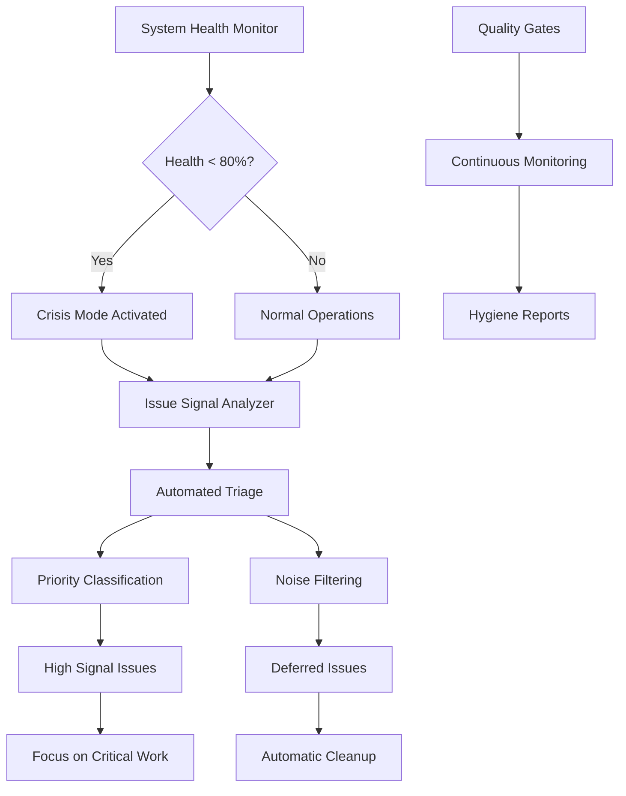

# 🎯 Issue Signal-to-Noise Optimization Framework

**Production-grade GitHub issues management system designed to maintain focus on critical infrastructure during system crises.**

## Executive Summary

The Issue Signal-to-Noise Optimization Framework addresses the critical challenge of attention dilution during system crises. When infrastructure fails (system health <80%), this framework automatically identifies high-impact issues and defers noise, ensuring engineering focus remains on critical recovery work.

**Key Benefits**:
- **Crisis Detection**: Automated recognition of system health degradation
- **Signal Amplification**: Mathematical scoring of issue impact and urgency  
- **Noise Suppression**: Intelligent deferral of non-critical work during crises
- **Quality Maintenance**: Continuous hygiene monitoring and automated cleanup
- **Operational Excellence**: GitHub Actions integration for zero-touch management

## Architecture Overview



## System Components

### 1. 🔍 Issue Signal Analyzer

**Core Algorithm**: Multi-factor scoring system (0-100) based on:
- **Priority Weight (40%)**: P0=100, P1=75, P2=50, P3=25 points
- **System Impact (30%)**: Keywords matching critical systems
- **Recency (15%)**: Time-decay function favoring recent issues
- **Dependencies (15%)**: Blocking relationships and prerequisites

**Crisis Mode Modifiers**:
- Non-critical labels: 70% score penalty
- Emergency mode (<50% health): Only P0/P1 get full weight
- Automatic noise classification for enhancement work

### 2. 🚨 Crisis Mode Protocol

**Activation Triggers**:
- **Crisis Mode**: System health <80% 
- **Emergency Mode**: System health <50%

**Automated Actions**:
1. **Issue Pausing**: Add 'paused' labels to noise issues
2. **Crisis Tracking**: Create tracking issue for recovery coordination
3. **Status Updates**: Repository crisis status documentation
4. **Focus Enforcement**: Only P0/P1 infrastructure issues active

**Critical Systems Keywords**:
```javascript
authentication, oauth, auth, login
website, deployment, ci, cd, pipeline  
production, monitoring, health
es module, import, export, module loading
test, testing, workflow, build
```

### 3. 📊 Quality Gates System

**Continuous Monitoring Metrics**:
- **Signal-to-Noise Ratio**: Target >1.0 (more signal than noise)
- **Average Issue Age**: Target <30 days
- **Stale Issue Count**: Issues inactive >30 days
- **Unlabeled High-Impact**: High-scoring issues missing priorities

**Quality Scoring Algorithm**:
```javascript
Base Score = 100
- Signal/Noise < 0.5: -25 points
- Average age > 60 days: -20 points  
- Stale issues > 10: -20 points
- Unlabeled high-impact > 5: -15 points
```

### 4. 🔄 Automated Issue Lifecycle

**GitHub Actions Integration**:
- **Schedule**: Every 6 hours for continuous monitoring
- **Event Triggers**: Issue creation, labeling, updates
- **Manual Dispatch**: On-demand optimization with dry-run mode

**Workflow Jobs**:
1. **System Health Assessment** - Monitor current system status
2. **Signal Analysis** - Calculate signal-to-noise metrics  
3. **Crisis Protocol** - Activate crisis response if needed
4. **Quality Gates** - Run hygiene and scoring assessments
5. **Automated Cleanup** - Close stale issues, add missing labels
6. **Results Summary** - Generate comprehensive reports

## Implementation Guide

### Quick Start

1. **Deploy Core System**:
```bash
# Copy optimizer script to your repository
cp issue-signal-optimizer.js .github/scripts/

# Deploy GitHub Actions workflow  
cp issue-optimization.yml .github/workflows/

# Install dependencies
cd .github/scripts && npm install
```

2. **Run Initial Analysis**:
```bash
# Analyze current issue signal-to-noise ratio
node issue-signal-optimizer.js analyze

# Run quality assessment
node issue-signal-optimizer.js quality

# Test crisis protocol (dry run)
node issue-signal-optimizer.js crisis --dry-run
```

3. **Configure Automation**:
```yaml
# In .github/workflows/issue-optimization.yml
env:
  CRISIS_THRESHOLD: 80    # Customize crisis activation threshold
  CLEANUP_ENABLED: true   # Enable automated cleanup
  DRY_RUN_MODE: false    # Set to true for testing
```

### Configuration Options

**Signal Detection Configuration**:
```javascript
const SIGNAL_DETECTION_CONFIG = {
  // Crisis activation thresholds
  CRISIS_HEALTH_THRESHOLD: 80,     // <80% triggers crisis mode
  CRITICAL_HEALTH_THRESHOLD: 50,   // <50% triggers emergency
  
  // Scoring weights (must sum to 100)
  SIGNAL_WEIGHTS: {
    priority: 40,      // Priority label weight
    system_impact: 30, // Critical system keywords  
    recency: 15,       // Time-based relevance
    dependencies: 15   // Blocking relationships
  },
  
  // Customize critical system patterns
  CRITICAL_SYSTEMS: [
    'authentication', 'production', 'website',
    'ci', 'pipeline', 'security', 'data-integrity'
  ],
  
  // Noise indicators for low-priority work
  NOISE_INDICATORS: [
    'epic', 'enhancement', 'analytics',
    'dashboard', 'optimization', 'refactor'
  ]
};
```

**Crisis Mode Labels**:
Only these labels remain active during crisis:
- `P0: Critical`, `P1: High`
- `bug`, `security`, `infrastructure`  
- `reliability`, `ci-cd`, `workflow`

### Advanced Usage

**Custom Signal Analysis**:
```javascript
import { IssueSignalAnalyzer } from './issue-signal-optimizer.js';

// Create analyzer with current system health
const systemHealth = 65; // Get from monitoring system
const analyzer = new IssueSignalAnalyzer(systemHealth);

// Analyze specific issue
const issue = await fetchIssueData(issueNumber);
const score = analyzer.calculateSignalScore(issue);
const classification = analyzer.classifyIssue(issue);

console.log(`Issue #${issueNumber}: ${score} points (${classification})`);
```

**Manual Crisis Activation**:
```bash
# Force crisis mode activation regardless of system health
node issue-signal-optimizer.js crisis --force

# Pause specific issue types during crisis
gh issue list --label "enhancement" --json number | \
  jq -r '.[].number' | \
  xargs -I {} gh issue edit {} --add-label "paused"
```

## Operational Procedures

### Crisis Response Checklist

When system health drops below 80%:

1. **Immediate Assessment** (5 minutes):
   - [ ] Verify crisis mode activation in GitHub Actions
   - [ ] Review crisis tracking issue created automatically
   - [ ] Confirm non-critical issues marked as 'paused'

2. **Focus Enforcement** (10 minutes):
   - [ ] Identify top 5 signal issues from analysis report
   - [ ] Validate P0/P1 critical issues have proper labels
   - [ ] Defer any enhancement/analytics work to post-crisis

3. **Infrastructure Recovery** (varies):
   - [ ] Address authentication failures (P0)
   - [ ] Resolve website/DNS issues (P0)
   - [ ] Fix CI/CD pipeline failures (P1)
   - [ ] Restore monitoring systems (P1)

4. **Recovery Validation** (15 minutes):
   - [ ] System health sustained >80% for 4 hours minimum
   - [ ] All P0 critical issues resolved
   - [ ] Monitoring dashboard showing green status

### Normal Operations Maintenance

**Weekly Quality Review**:
```bash
# Generate comprehensive quality report
node issue-signal-optimizer.js quality

# Review signal-to-noise ratio trends
grep "Signal Ratio" data/issue-quality-report.json | tail -10

# Identify improvement opportunities
node issue-signal-optimizer.js analyze --recommendations-only
```

**Monthly Issue Hygiene**:
```bash
# Close stale low-priority issues (dry run first)
node issue-signal-optimizer.js cleanup --dry-run
node issue-signal-optimizer.js cleanup

# Add missing priority labels
gh issue list --search "no:label" --json number,title | \
  jq -r '.[] | select(.title | test("critical|urgent|broken")) | .number' | \
  xargs -I {} gh issue edit {} --add-label "P1: High"
```

## Success Metrics & KPIs

### Signal Quality Metrics

**Target Benchmarks**:
- **Signal-to-Noise Ratio**: >1.5 (60%+ signal issues)
- **Quality Score**: >80/100 sustained
- **Average Issue Age**: <21 days
- **Stale Issue Count**: <5% of total open issues
- **Crisis Response Time**: <30 minutes to protocol activation

**Tracking Dashboard**:
```javascript
// Key metrics extracted from quality reports
{
  "signalToNoiseRatio": 1.8,        // Target: >1.5
  "qualityScore": 85,               // Target: >80
  "averageIssueAge": 18.5,         // Target: <21 days  
  "staleIssuePercentage": 3.2,     // Target: <5%
  "crisisActivations": 2,          // Monthly count
  "averageRecoveryTime": 4.2       // Hours to >80% health
}
```

### Business Impact Metrics

**Engineering Productivity**:
- **Focus Time**: Reduction in context-switching between issues
- **Resolution Velocity**: Faster P0/P1 issue resolution during crisis
- **Technical Debt**: Prevention of low-priority accumulation

**System Reliability**:
- **Mean Time to Recovery (MTTR)**: Crisis resolution speed
- **Crisis Prevention**: Early detection via quality degradation
- **Operational Excellence**: Reduced manual issue management overhead

## Integration Examples

### Custom System Health Monitoring

```javascript
// Integrate with existing monitoring system
async function getSystemHealthFromMonitoring() {
  const monitoring = await fetch('/api/system-health');
  const data = await monitoring.json();
  
  // Calculate composite health score
  const healthScore = {
    authentication: data.auth.success ? 25 : 0,
    website: data.website.uptime > 0.99 ? 25 : 0,
    cicd: data.workflows.successRate > 0.95 ? 25 : 0,
    monitoring: data.observability.coverage > 0.9 ? 25 : 0
  };
  
  return Object.values(healthScore).reduce((sum, score) => sum + score, 0);
}
```

### Slack/Teams Integration

```javascript
// Notify team when crisis mode activates
async function notifyTeamCrisisMode(systemHealth) {
  const message = {
    text: `🚨 Crisis Mode Activated - System Health: ${systemHealth}%`,
    attachments: [{
      color: systemHealth < 50 ? 'danger' : 'warning',
      fields: [
        { title: 'Priority', value: 'Only P0/P1 infrastructure issues', short: true },
        { title: 'Action Required', value: 'Focus on critical system recovery', short: true }
      ]
    }]
  };
  
  await fetch(SLACK_WEBHOOK_URL, {
    method: 'POST',
    body: JSON.stringify(message)
  });
}
```

### Repository Health Dashboard

```html
<!-- Embed real-time status badges -->
<div class="repository-status">
  
  
</div>
```

## Troubleshooting

### Common Issues

**Crisis Mode Not Activating**:
```bash
# Check system health data availability
cat data/production-monitoring.json | jq '.systemHealth'

# Verify GitHub Actions permissions
gh auth status
gh workflow list --repo owner/repo

# Manual crisis activation for testing
node issue-signal-optimizer.js crisis --force --dry-run
```

**Signal Analysis Returning Low Scores**:
```bash
# Debug scoring algorithm for specific issue
node -e "
const { IssueSignalAnalyzer } = require('./issue-signal-optimizer.js');
const analyzer = new IssueSignalAnalyzer(75);
const issue = { title: 'Authentication failure', labels: [{ name: 'P0: Critical' }] };
console.log('Score:', analyzer.calculateSignalScore(issue));
console.log('Classification:', analyzer.classifyIssue(issue));
"
```

**Workflow Permissions Issues**:
```yaml
# Ensure proper GitHub token permissions in workflow
permissions:
  issues: write
  contents: write
  actions: read
  pull-requests: read
```

### Performance Optimization

**Large Repositories (>500 issues)**:
```javascript
// Implement pagination and caching
const BATCH_SIZE = 50;
const CACHE_TTL = 300; // 5 minutes

async function fetchIssuesBatched() {
  const allIssues = [];
  let page = 1;
  
  while (true) {
    const batch = await fetchIssuesPage(page, BATCH_SIZE);
    if (batch.length === 0) break;
    
    allIssues.push(...batch);
    page++;
    
    // Rate limiting
    await new Promise(resolve => setTimeout(resolve, 100));
  }
  
  return allIssues;
}
```

## Future Enhancements

### Phase 2 - Machine Learning Integration

**Intelligent Priority Prediction**:
- Historical issue resolution time analysis
- Automated priority label suggestions based on content
- Predictive crisis detection using trend analysis

**Advanced Signal Detection**:
- Natural language processing for issue content analysis
- Dependency graph analysis for impact propagation
- Contributor expertise matching for optimal assignment

### Phase 3 - Enterprise Features

**Multi-Repository Management**:
- Organization-wide signal-to-noise optimization
- Cross-repository dependency tracking
- Centralized crisis coordination dashboard

**Advanced Automation**:
- Intelligent issue merging and deduplication
- Automated test case generation from bug reports
- Dynamic milestone and sprint planning integration

---

This framework represents a significant advancement in repository management, enabling teams to maintain focus on critical work while systematically managing technical debt and enhancement backlogs. The automated crisis response ensures that system reliability takes precedence during infrastructure emergencies, while continuous quality monitoring prevents attention dilution in normal operations.

**Next Steps**: Deploy the framework, monitor initial metrics, and iterate based on team-specific patterns and requirements.