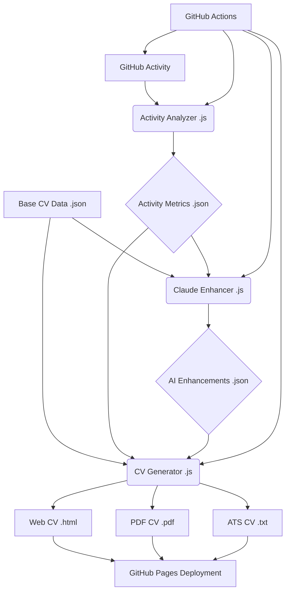

# System Architecture

This section provides a comprehensive overview of the AI-enhanced CV system's architecture, detailing its core components, their roles, and how they interact to create a dynamic and continuously updated professional portfolio.

## Overview

The AI-enhanced CV system is designed as a modular, data-driven application that leverages automation and artificial intelligence to maintain an up-to-date and compelling professional profile. It transforms raw GitHub activity and static CV data into an optimized, multi-format CV asset.

At a high level, the system operates through a pipeline of interconnected components:

1.  **Data Collection & Analysis**: Gathers raw GitHub activity and processes it into meaningful professional metrics.
2.  **AI Enhancement**: Utilizes a large language model (Claude AI) to refine and optimize CV content based on collected data and strategic prompts.
3.  **CV Generation**: Compiles all processed data and AI enhancements into various output formats (web, PDF, plain text, etc.).
4.  **Automation & Deployment**: Orchestrates the entire pipeline using GitHub Actions, ensuring continuous updates and deployment to GitHub Pages.

## Component Breakdown

### 1. Activity Analyzer (`.github/scripts/activity-analyzer.js`)

*   **Role**: The quantitative engine of the CV. It connects to the GitHub API and analyzes repository contributions, commit history, language usage, and other activity patterns to generate objective professional metrics.
*   **Inputs**: GitHub API data (user profile, repositories, events), local Git history.
*   **Outputs**: `activity-summary.json` (summarized metrics), detailed activity analysis JSON files.
*   **Key Functionalities**:
    *   Calculates `overall_professional_score`.
    *   Analyzes skill proficiency based on language usage and project complexity.
    *   Tracks development velocity and consistency.

### 2. Claude Enhancer (`.github/scripts/claude-enhancer.js`)

*   **Role**: The AI-powered content strategist. It leverages the Claude API to transform raw CV data and activity metrics into compelling, optimized narratives.
*   **Inputs**: `base-cv.json`, `activity-summary.json`, Claude API key, AI creativity level.
*   **Outputs**: `ai-enhancements.json` (AI-optimized professional summary, skills, experience, projects).
*   **Key Functionalities**:
    *   Generates enhanced professional summaries.
    *   Optimizes skill descriptions and identifies market-relevant skills.
    *   Refines experience and project descriptions with quantifiable impact.
    *   Implements intelligent caching for API responses to optimize token usage.

### 3. CV Generator (`.github/scripts/cv-generator.js`)

*   **Role**: The presentation layer orchestrator. It compiles all data sources and AI enhancements into various consumable CV formats.
*   **Inputs**: `base-cv.json`, `activity-summary.json`, `ai-enhancements.json`.
*   **Outputs**:
    *   `dist/index.html`: The interactive web-based CV.
    *   `dist/assets/adrian-wedd-cv.pdf`: A high-quality PDF version of the CV.
    *   (Future) `dist/assets/adrian-wedd-cv-ats.txt`: Plain text version optimized for Applicant Tracking Systems.
    *   (Future) `dist/assets/adrian-wedd-cv.docx`: Microsoft Word document version.
    *   (Future) `dist/assets/adrian-wedd-cv.tex`: LaTeX version.
*   **Key Functionalities**:
    *   HTML templating and dynamic content injection.
    *   Asset copying (CSS, JavaScript, data files).
    *   Sitemap, robots.txt, and web manifest generation.
    *   PDF generation using Puppeteer.

### 4. Frontend (Web UI) (`assets/script.js`, `index.html`, `assets/styles.css`)

*   **Role**: The interactive digital storefront of the CV. It provides a responsive and engaging user experience.
*   **Technologies**: HTML5, CSS3, JavaScript (ES6+).
*   **Key Functionalities**:
    *   Dynamic loading of CV content from JSON files.
    *   Smooth navigation between sections.
    *   Dark/light theme switching.
    *   Display of live GitHub activity statistics.

### 5. GitHub Actions (`.github/workflows/`)

*   **Role**: The automated project manager. These workflows orchestrate the entire CI/CD pipeline, ensuring continuous integration, analysis, enhancement, and deployment.
*   **Key Workflows**:
    *   `cv-enhancement.yml`: Main pipeline for CV generation and deployment.
    *   `activity-tracker.yml`: Dedicated to continuous GitHub activity data collection.
*   **Key Functionalities**:
    *   Scheduled and manual triggering of processes.
    *   Dependency management and caching.
    *   Environment variable and secret handling.
    *   Automated testing (unit tests, linting, validation).
    *   Deployment to GitHub Pages.
    *   Commit of updated data back to the repository.

## Data Flow

Data flows through the system in a well-defined pipeline, ensuring that each stage builds upon the output of the previous one. The central data hub is the `data/` directory within the repository, where intermediate and final data assets are stored.

1.  **GitHub Activity -> Activity Analyzer**: Raw GitHub activity (commits, repos, user data) is pulled by the `Activity Analyzer`.
2.  **Activity Analyzer -> Activity Metrics**: The `Activity Analyzer` processes this raw data and outputs `activity-summary.json` and other detailed activity metrics.
3.  **Base CV Data + Activity Metrics -> Claude Enhancer**: The static `base-cv.json` and the dynamic `activity-summary.json` are fed into the `Claude Enhancer`.
4.  **Claude Enhancer -> AI Enhancements**: The `Claude Enhancer` generates AI-optimized content, stored in `ai-enhancements.json`.
5.  **Base CV Data + Activity Metrics + AI Enhancements -> CV Generator**: All three primary data sources are consumed by the `CV Generator`.
6.  **CV Generator -> Output Formats**: The `CV Generator` produces the final CV assets: `index.html`, `adrian-wedd-cv.pdf`, and future formats like `adrian-wedd-cv-ats.txt`, `adrian-wedd-cv.docx`, and `adrian-wedd-cv.tex`.
7.  **Output Formats -> GitHub Pages Deployment**: The generated assets are deployed to GitHub Pages for public access.
8.  **GitHub Actions**: Orchestrates all these steps, from data collection to deployment, and commits updated data back to the repository, closing the loop for continuous integration.

## Technology Stack

*   **Primary Languages**: JavaScript (Node.js), Shell Scripting (Bash).
*   **AI/ML**: Anthropic Claude API.
*   **Web Technologies**: HTML5, CSS3.
*   **Frontend Frameworks/Libraries**: None (Vanilla JavaScript).
*   **Build/Automation**: npm, GitHub Actions.
*   **PDF Generation**: Puppeteer.
*   **Data Processing**: `jq` (JSON processor).
*   **Testing**: Node.js native test runner.

