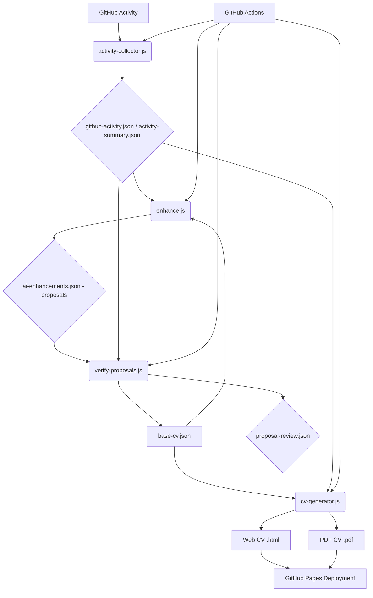

# System Architecture

This section provides a comprehensive overview of the AI-enhanced CV system's architecture, detailing its core components, their roles, and how they interact to create a dynamic and continuously updated professional portfolio.

## Overview

The AI-enhanced CV system is designed as a modular, data-driven application that leverages automation and artificial intelligence to maintain an up-to-date and compelling professional profile. It transforms raw GitHub activity and static CV data into an optimized, multi-format CV asset.

At a high level, the system operates through a pipeline of separated stages, each with explicit outcome semantics (SUCCESS / SKIPPED / FAILED):

1.  **Evidence Ingestion**: Gathers real cross-repo GitHub activity and processes it into meaningful professional metrics.
2.  **AI Proposal**: Utilizes a large language model (via a provider-neutral client — OpenRouter by default, Ollama or Gemini alternatively) to propose per-section content rewrites bounded by the collected evidence. Proposals are never rendered directly.
3.  **Verification**: Rejects proposals containing unsupported numbers, new credentials, corporate filler, or drastic length changes; applies only the survivors to `base-cv.json`.
4.  **Validation & Generation**: Runs hard content-integrity gates, then compiles the verified data into the output formats (web, PDF).
5.  **Automation & Deployment**: Orchestrates the entire pipeline using GitHub Actions, ensuring continuous updates and deployment to GitHub Pages.

```mermaid
graph TD
    A[GitHub Activity] --> B(activity-collector.js)
    B --> C{github-activity.json / activity-summary.json}
    D[base-cv.json] --> E(enhance.js)
    C --> E
    E --> F{ai-enhancements.json - proposals}
    F --> V(verify-proposals.js)
    C --> V
    V --> D
    V --> R{proposal-review.json}
    D --> G(cv-generator.js)
    C --> G
    G --> H[Web CV .html]
    G --> I[PDF CV .pdf]
    K[GitHub Actions] --> B
    K --> E
    K --> V
    K --> G
    H --> L[GitHub Pages Deployment]
    I --> L
```

## Component Breakdown

### 1. Activity Collector (`.github/scripts/activity-collector.js`)

*   **Role**: The quantitative engine of the CV. It measures the whole GitHub account (not this repo's git log, which is dominated by automation commits) via the GraphQL contribution calendar plus REST repository, event, and commit-search data.
*   **Inputs**: GitHub API data (contribution calendar, repositories, public events, commit search).
*   **Outputs**: `github-activity.json` (full evidence snapshot: summary, heatmap, commit timeline, languages, active repositories) and `activity-summary.json` (compact website summary).
*   **Key Functionalities**:
    *   Cross-repo commit counts, active days, and active-repository inventory over a configurable lookback window.
    *   Weekly contribution heatmap and per-repo commit timeline for the frontend activity panels.
    *   Language mix by repository size.

### 2. AI Enhancer (`.github/scripts/enhance.js` + `.github/scripts/ai/client.js`)

*   **Role**: The proposal stage. It asks an AI provider for per-section rewrites of the professional summary and experience/project descriptions, bounded by the collected evidence. `ai/client.js` is a provider-neutral chat client (no SDKs) supporting `openrouter` (CI default, model `deepseek/deepseek-v4-flash`), `ollama` (local), and `gemini`.
*   **Inputs**: `base-cv.json`, `activity-summary.json`, mined narratives, an AI provider API key (`OPENROUTER_API_KEY`, `GEMINI_API_KEY`, or `OLLAMA_HOST`).
*   **Outputs**: `ai-enhancements.json` — **proposals only** with an explicit status (SUCCESS / SKIPPED / FAILED), never rendered directly and never touching `base-cv.json`.
*   **Key Functionalities**:
    *   Evidence-bounded prompts with measured token usage (no estimates).
    *   Per-section verdicts (`improved` / unchanged) with rationale.
    *   Reports SKIPPED when no provider is configured, so the pipeline can still deploy curated content.

### 3. Proposal Verifier (`.github/scripts/verify-proposals.js`)

*   **Role**: The gatekeeper between AI output and the CV. Rejecting every proposal is a healthy outcome — the previous good version always beats a worse rewrite.
*   **Inputs**: `ai-enhancements.json`, `base-cv.json`, and the evidence corpus (`activity-summary.json`, `github-activity.json`, `data/narratives/`, `data/intelligence/`).
*   **Outputs**: An updated `base-cv.json` (accepted proposals applied) and `proposal-review.json` (per-proposal verdicts).
*   **Key Functionalities**:
    *   Quantity guard: rejects numbers/claims unsupported by the evidence corpus.
    *   Credential guard: rejects newly invented certifications or credentials.
    *   Beige guard: rejects corporate filler and meta-commentary.
    *   Size guard: rejects drastic length changes.

### 4. CV Generator (`.github/scripts/cv-generator.js`)

*   **Role**: The presentation layer orchestrator. It compiles the verified data sources into the consumable CV formats.
*   **Inputs**: `base-cv.json`, `activity-summary.json`, `github-activity.json`.
*   **Outputs**:
    *   `dist/index.html`: The interactive web-based CV.
    *   `dist/assets/adrian-wedd-cv.pdf`: A high-quality full PDF version of the CV (Puppeteer).
    *   `dist/assets/adrian-wedd-cv-short.pdf`: An ATS-optimized short PDF rendered from `ats-template.html`.
*   **Key Functionalities**:
    *   HTML templating and dynamic content injection.
    *   Asset copying (CSS, JavaScript, data files).
    *   Sitemap, robots.txt, and web manifest generation.
    *   PDF generation using Puppeteer.

### 5. Frontend (Web UI) (`assets/script.js`, `index.html`, `assets/styles.css`)

*   **Role**: The interactive digital storefront of the CV. It provides a responsive and engaging user experience.
*   **Technologies**: HTML5, CSS3, JavaScript (ES6+).
*   **Key Functionalities**:
    *   Dynamic loading of CV content from `base-cv.json` (inlined as `window.__CV_DATA__` in production builds) — the frontend does not call `api.github.com` and does not read `ai-enhancements.json`.
    *   Activity panels rendered by `assets/activity-viz.js` from `github-activity.json`.
    *   Smooth navigation between sections.
    *   Dark/light theme switching.

### 6. GitHub Actions (`.github/workflows/`)

*   **Role**: The automated project manager. These workflows orchestrate the entire CI/CD pipeline, ensuring continuous integration, analysis, enhancement, and deployment.
*   **Key Workflows**:
    *   `cv-enhancement.yml`: Main pipeline for CV enhancement, generation, and deployment (weekly Mondays 21:00 UTC, on evidence dispatch, or manual).
    *   `activity-tracker.yml`: Daily GitHub activity evidence collection; commits only on material change and triggers the enhancement pipeline via `repository_dispatch`.
*   **Key Functionalities**:
    *   Scheduled and manual triggering of processes.
    *   Dependency management and caching.
    *   Environment variable and secret handling.
    *   Automated testing (unit tests, linting, validation).
    *   Deployment to GitHub Pages.
    *   Commit of updated data back to the repository.

## Data Flow

Data flows through the system in a well-defined pipeline, ensuring that each stage builds upon the output of the previous one. The central data hub is the `data/` directory within the repository, where intermediate and final data assets are stored.

1.  **GitHub Activity -> Activity Collector**: Raw cross-repo GitHub activity is pulled by `activity-collector.js`.
2.  **Activity Collector -> Evidence**: The collector outputs `github-activity.json` (full evidence snapshot) and `activity-summary.json` (compact summary).
3.  **Base CV Data + Evidence -> AI Enhancer**: The curated `base-cv.json` and the collected evidence are fed into `enhance.js`.
4.  **AI Enhancer -> Proposals**: `enhance.js` writes per-section proposals to `ai-enhancements.json` — never applied directly.
5.  **Proposals + Evidence -> Verifier -> Base CV Data**: `verify-proposals.js` checks each proposal against the evidence corpus, applies only the accepted ones to `base-cv.json`, and records verdicts in `proposal-review.json`.
6.  **Base CV Data + Evidence -> CV Generator -> Output Formats**: `cv-generator.js` produces the final CV assets: `index.html`, `adrian-wedd-cv.pdf`, and `adrian-wedd-cv-short.pdf`.
7.  **Output Formats -> GitHub Pages Deployment**: The generated assets are committed back to `main`, which GitHub Pages serves.
8.  **GitHub Actions**: Orchestrates all these steps, from data collection to deployment, and commits updated data back to the repository, closing the loop for continuous integration.

### 7. Python Utilities (`src/python/`)

This set of Python modules is **experimental and not yet integrated** into the running system: no GitHub Actions workflow, JavaScript script, `package.json`, or `index.html` references `src/python`. The live CI pipeline (`activity-tracker.yml`, `cv-enhancement.yml`) runs only Node.js scripts from `.github/scripts/`. The modules below are provided as foundational utilities pending integration.

*   **`utils/logging_utils.py`** (`src/python/utils/logging_utils.py`): Provides advanced logging and metrics collection capabilities, allowing for structured logging and performance monitoring.
*   **`api_wrappers/external_apis.py`**: Contains wrappers for external APIs (e.g., firmographics, funding data), abstracting API interactions and handling authentication and error management.
*   **`config_manager/config_manager.py`**: Implements a flexible configuration management system that can load settings from `.ini` files and environment variables, with environment variables taking precedence.
*   **`data_validation/data_validator.py`**: Offers a suite of data validation functions for common tasks such as type checking, range validation, and format validation (e.g., email, URL).

## Technology Stack

*   **Primary Languages**: JavaScript (Node.js), Shell Scripting (Bash). (Python exists under `src/python/` but is experimental and not wired into the running system.)
*   **AI/ML**: Provider-neutral chat client (`.github/scripts/ai/client.js`): OpenRouter (default, `deepseek/deepseek-v4-flash`), Ollama (local), or Gemini. (The earlier Anthropic Claude API integration was retired.)
*   **Web Technologies**: HTML5, CSS3.
*   **Frontend Frameworks/Libraries**: None (Vanilla JavaScript, ES modules).
*   **Build/Automation**: npm, GitHub Actions.
*   **PDF Generation**: Puppeteer.
*   **Data Processing**: `jq` (JSON processor in CI), plus Node.js scripts.
*   **Testing**: Node.js native test runner (active CI gate). The `src/python/` `unittest`/`pytest` suite is standalone/manual and not run in CI.
